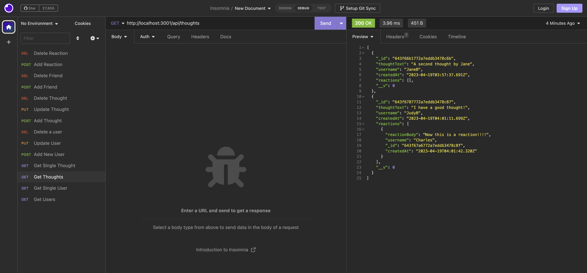

# Social-Networking-API

## Description

This applications runs via the command line and uses Insomnia to check CRUD operations for Users and Thoughts model.

## Installation

- Clone this repo
- Run `npm i` to install dependencies
- Install Insomnia
- Install MongoDb and Compass

## Usage

- Run `npm start` to start the server

- Use Insomnia to check the following routes
- Get Users (GET) `http://localhost:3001/api/users`
- Get Single User (GET) `http://localhost:3001/api/users/:userId`
- Get Thoughts (GET) `http://localhost:3001/api/thoughts`
- Get Single Thought (GET) `http://localhost:3001/api/thoughts/:thoughtId`
- Add User (POST) `http://localhost:3001/api/users` and pass in an object with values for `name` and `email`
- Update User (PUT) `http://localhost:3001/api/users/:userId` and pass in an object with values to update `name` and `email`
- Delete User (DELETE) `http://localhost:3001/api/users/:userId`
- Add Thought (POST) `http://localhost:3001/api/thoughts` and pass in an object with `userId`, `thoughtText`, and `username`
- Update Thought (PUT) `http://localhost:3001/api/thoughts/:thoughtId` and pass in an object with values to update `userId`, `thoughtText`, and/or `username`
- Delete Thought (DELETE) `http://localhost:3001/api/thoughts/:thoughtId`
- Add Friend (POST) `http://localhost:3001/api/users/:userId/friends/:friendId`
- Delete Friend (DELETE) `http://localhost:3001/api/users/:userId/friends/:friendId`
- Add Reaction (POST) `http://localhost:3001/api/thoughts/:thoughtId/reactions` and pass in an object with values for `reactionBody` and `username`
- Delete Reaction (DELETE) `http://localhost:3001/api/thoughts/:thoughtId/reactions/:reactionId`

### Screenshot of the project

## Credits

Eric Nguyen

## Questions

[Github Profile](https://github.com/ericnguyen23)

For any additional questions, please email me at ericnguyen23@gmail.com
